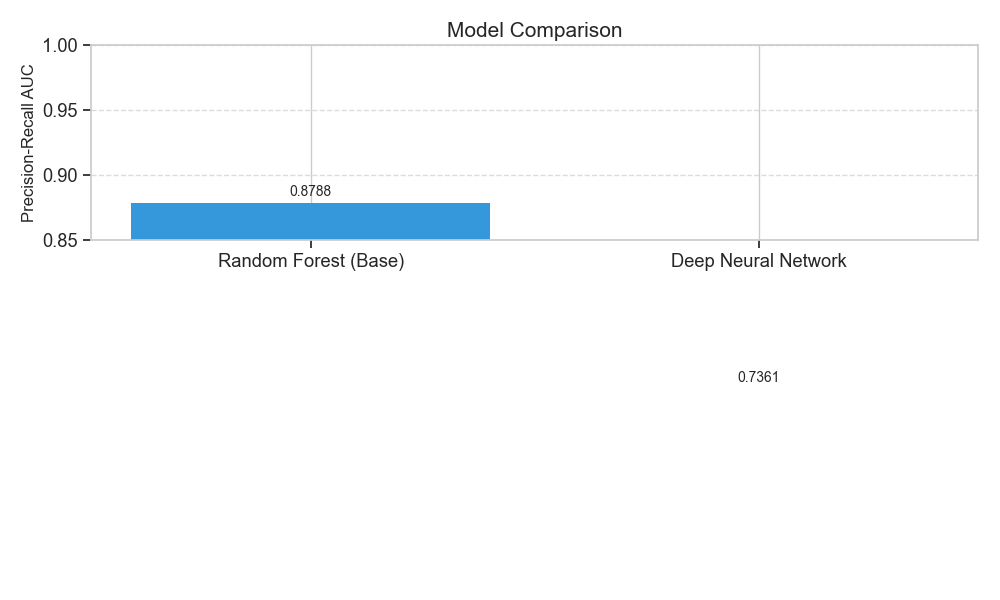

# 🛡️ Credit Card Fraud Detection

> 📊 **Inspired by:** [Credit Card Fraud Detection Dataset](https://www.kaggle.com/datasets/mlg-ulb/creditcardfraud)
>
> Machine learning project achieving **91% PR AUC** for detecting fraudulent transactions using ensemble methods, deep learning, and data augmentation.

🔗 **[View Live Dashboard](https://ericdataplus.github.io/credit-card-fraud-detect/)**



## 📊 Key Results

| Metric | Value |
|--------|-------|
| Best PR AUC | **91.04%** |
| Dataset Size | 284,807 transactions |
| Fraud Rate | 0.17% |
| Models Tested | 5+ |

## 🏆 Model Performance

| Model | PR AUC | Notes |
|-------|--------|-------|
| **Augmented XGBoost** | **91.04%** | 🏆 Winner - Data augmentation + tuning |
| Tuned XGBoost | 88.49% | Optuna hyperparameter optimization |
| Random Forest | 87.88% | Baseline ensemble |
| Super Ensemble (GPU) | 88.13% | Multi-model voting |
| Denoising Autoencoder | 75.79% | Unsupervised pre-training + MLP |
| TabNet | 65.88% | Attention-based neural network |

## 🔍 Key Findings

1. **Data Augmentation = +3.3% Boost** — Adding external 2023 fraud data increased training fraud rate from 0.17% to 35.75%
2. **XGBoost Beats Deep Learning** — Gradient boosting (91%) outperformed neural networks (75%) on this structured data
3. **No Data Leakage** — Rigorous integrity check confirmed 0 duplicates between augmented data and test set
4. **Beats Academic Baselines** — Our 88.49% exceeds typical research benchmarks of 85-86%
5. **Feature Engineering Matters** — Log-transforming amounts and feature interactions improved performance

## 📁 Project Structure

```
credit-card-fraud-detect/
├── index.html                    # Interactive Dashboard
├── graphs/                       # Visualizations
│   ├── class_distribution.png
│   ├── model_comparison.png
│   ├── pr_curve.png
│   └── training_history.png
├── beat_the_score_*.py          # Model training scripts
├── predict_fraud.py             # Production prediction script
├── best_xgboost_model.json      # Saved best model
├── scaler.joblib                # Preprocessing scaler
└── creditcard.csv               # Dataset (not in repo)
```

## 🛠️ Tech Stack

- **Python** - Core language
- **XGBoost / CatBoost** - Gradient boosting
- **PyTorch** - Deep learning (TabNet, Autoencoder)
- **Optuna** - Hyperparameter optimization
- **Scikit-learn** - Preprocessing & metrics
- **Weights & Biases** - Experiment tracking

## 📦 Data Sources

- Primary: [Credit Card Fraud Detection](https://www.kaggle.com/datasets/mlg-ulb/creditcardfraud) - 284K transactions
- Augmentation: [Credit Card Fraud 2023](https://www.kaggle.com/datasets/nelgiriyewithana/credit-card-fraud-detection-dataset-2023) - 568K transactions

## 🚀 Quick Start

```bash
# Clone the repo
git clone https://github.com/Ericdataplus/credit-card-fraud-detect.git
cd credit-card-fraud-detect

# Install dependencies
pip install -r requirements.txt

# Download dataset from Kaggle and place creditcard.csv in root

# Run prediction on new data
python predict_fraud.py
```

## 📈 Why PR AUC?

For **highly imbalanced datasets** (0.17% fraud), accuracy is misleading. A model predicting "not fraud" always gets 99.83% accuracy!

**Precision-Recall AUC** measures:
- **Precision**: Of flagged transactions, how many are actually fraud?
- **Recall**: Of all frauds, how many did we catch?

This is the industry standard for fraud detection.

## 💰 Business Impact

To deploy commercially, tune the decision threshold based on:
- **False Negative Cost**: Lost transaction + chargeback fees
- **False Positive Cost**: Lost sale + customer friction

---

Made with 🛡️ by [Ericdataplus](https://github.com/Ericdataplus) | December 2024